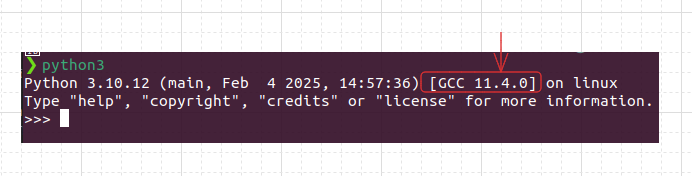

# পাইথন ইমপ্লিমেন্টেশন 

আমরা যখন পাইথন নিয়ে কথা বলি তা মূলত ২ টি জিনিস কে বুঝায়ঃ 
1. Python language
2. A particular python implementation

## Python language
এটি মূলত পাইথন ল্যাঙ্গুয়েজ এর কিছু সেট অফ রুলস এবং গ্রামার কে বুঝায় যা দিয়ে আমরা প্রোগ্রাম লিখি

## Python implementation
এটি মূলত একটি প্রোগ্রাম যা সেইসব পাইথন রুলস এবং প্রোগ্রাম কে বুঝে এবং সেগুলোকে এক্সিকিউট করে।  

আমরা পূর্বে যেই পাইথন টি ডাউনলোড করেছি বা ইন্সটল করেছি সেটি মূলত পাইথনের ডিফল্ট ইমপ্লিমেন্টেশন যাকে বলা হয় cPython. এটি C প্রোগ্রামিং ভাষা দিয়ে করা হয়েছে দেখে
এটাকে বলা হয় cPython. আমরা যখন টার্মিনাল এ python3 রান করি তখন কিন্তু এইটা দেখতে পারি। যেমন টার্মিনালে python3 লিখে এনটার চাপ দিলে নিচের মত আউটপুট পাব

এছাড়াও পাইথনের আরও কিছু ইমপ্লিমেন্টেশন রয়েছে যেমন
1. Jython - written in Java
2. IronPython - written in C#
3. PyPy - written in a subset of python

পাইথন ল্যাঙ্গুয়েজ এ কোন নতুন ফিচার আসলে সেটি প্রথমে cPython এ আসে তারপর gradually অন্যান্য ইমপ্লিমেন্টেশন এ আসে। Theoritically সব ইমপ্লিমেন্টেশন সেম ফিচার দেয় তবে practically এই ডিফারেন্ট ইমপ্লিমেন্টেশন কিছু কিছু ক্ষেত্রে আলাদা সুবিধা দেয়। 

তবে আমাদের একটি দিক মনে রাখতে হবে যে কেন পাইথনের এই ডিফারেন্ট ইমপ্লিমেন্টেশন! এটার কারণ হলো যেমন Jython এর উদ্দেশ্য হলো যাতে কিছু Java প্রোগ্রাম Python প্রোগ্রামের সাথে রিইউজ করা যায়। 