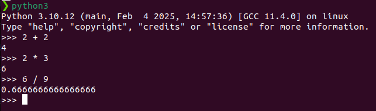

# পাইথন ইন্টারপ্রিটার কি? 

পাইথন ইন্টারপ্রিটার হল একটি প্রোগ্রাম যা পাইথন কোড লাইন বাই লাইন পড়ে, বিশ্লেষণ করে এবং কার্যকর করে। এটি পাইথন স্ক্রিপ্ট বা কমান্ডগুলো সরাসরি চালানোর অনুমতি দেয়, অর্থাৎ ইন্টারপ্রিটেড (Interpreted) ভাষা হিসেবে কাজ করে।

### কিভাবে এটি কাজ করে?
1. যখন আপনি একটি পাইথন স্ক্রিপ্ট চালান, ইন্টারপ্রিটার প্রথমে সোর্স কোড (Source Code) পড়ে।
2. এটি কোডকে বাইটকোডে (Bytecode) রূপান্তর করে।
3. তারপর, Python Virtual Machine (PVM) এর মাধ্যমে সেই বাইটকোড এক্সিকিউট করা হয়।

আমরা command prompt/terminal থেকে এই পাইথন ইন্তারপ্রিটার টি চালাতে পারি। এক্ষেত্রে আমাদের terminal টি ওপেন করে নিতে হবে তারপর যদি python3 লিখে enter দেই তাহলে নিচের মত একটি prompt ওপেন হবে। এখানে আমরা সরাসরি আমাদের python কোড টি রান করতে পারি। 



অথবা আমাদের যদি কোন python ফাইল থেকে থাকে যেমন আমার ফাইল টি হলো test_file.py তাহলে আমরা সেটাও এখানে রান করতে পারি নিচের মত করে। 

```
python3 test_file.py
```

তবে রিয়েল লাইফে আমরা যে ধরনের কোডিং লিখব বা এপ্লিকেশন বানাব সেক্ষেত্রে আমাদের কোড এডিটর / IDE এর প্রয়োজন পরবে। আমাদের পরবর্তী টিউটোরিয়াল এ আমরা জানব code editor / IDE কি! 


